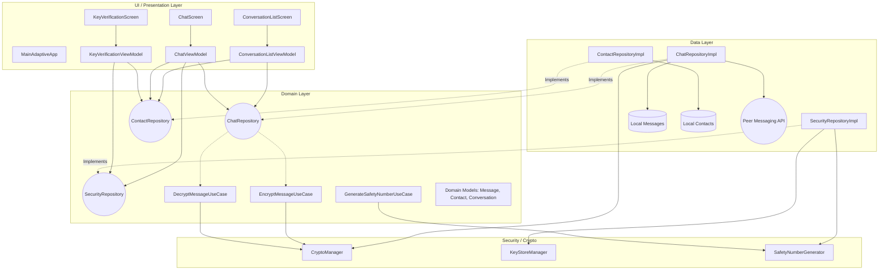
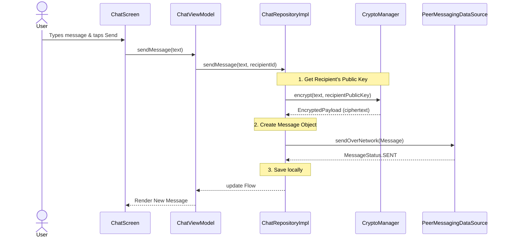

# GroupChat Architecture Overview

This document describes the high-level architecture of the **GroupChat** Android application. The project is structured using **Clean Architecture** principles and leverages modern Android development tools including **Jetpack Compose** (with Adaptive Layouts), **Coroutines/Flows**, and **Manual Dependency Injection**.

It simulates an End-to-End Encrypted (E2EE) messaging system.

## High-Level Architecture

The application is divided into three primary layers to separate concerns, improve testability, and keep the UI independent of data sources and business logic:

1.  **UI / Presentation Layer**: Handles rendering the UI and user interactions.
2.  **Domain Layer**: Contains the core business logic, use cases, and enterprise models.
3.  **Data Layer**: Manages data retrieval and storage, implementing the repository interfaces defined in the Domain layer.

### System Diagram

## Layer Breakdown

### 1. UI / Presentation Layer
-   **Jetpack Compose**: The entire UI is built using Jetpack Compose.
-   **Adaptive Layouts**: Uses `androidx.compose.adaptive` (`ListDetailPaneScaffold`) to automatically adjust the layout for different screen sizes (e.g., side-by-side list and detail on tablets, single screen on phones).
-   **ViewModels**: Each screen has a corresponding ViewModel (e.g., `ChatViewModel`) that manages UI state using `StateFlow`. ViewModels interact directly with Domain Repositories and map the results to UI states.

### 2. Domain Layer
-   **Models**: Pure Kotlin data classes representing core concepts (`Message`, `Contact`, `Conversation`, `EncryptedPayload`, `SafetyNumber`).
-   **Interfaces**: Defines repository interfaces (`ChatRepository`, `ContactRepository`, `SecurityRepository`) to apply the Dependency Inversion principle.
-   **Use Cases / Crypto**: Encapsulates specific business rules. `EncryptMessageUseCase` and `DecryptMessageUseCase` manage the simulated E2EE logic.

### 3. Data Layer
-   **Repositories**: Implementations of Domain interfaces (`ChatRepositoryImpl`, etc.). They orchestrate data between local storage and the network.
-   **Data Sources**:
    -   `LocalMessageDataSource` / `LocalContactDataSource`: Simulates local database storage for caching messages and contacts.
    -   `PeerMessagingDataSource`: Simulates a real-time network layer (like WebSockets or WebRTC) using Kotlin `Channel` and `Flow`. It handles "sending" messages and mocking "incoming" encrypted replies.

### 4. Security & Cryptography Module
Handles the End-to-End Encryption simulation:
-   **`KeyStoreManager`**: Manages generating, storing, and retrieving asymmetric keys (RSA) for users.
-   **`CryptoManager`**: Handles the actual encryption and decryption of message payloads.
-   **`SafetyNumberGenerator`**: Generates a reproducible fingerprint (safety number) from public keys, allowing users to verify identities (similar to Signal/WhatsApp).

## Message Flow Example

The following sequence diagram shows the flow of sending a message, from the UI down to the simulated network, demonstrating the encryption step.

## Dependency Injection
The project uses **Manual Dependency Injection** via an `AppContainer` class. This container creates and provides singletons of the repositories, data sources, and managers to the ViewModels, keeping the architecture decoupled without the overhead of Dagger/Hilt for this specific scope.
