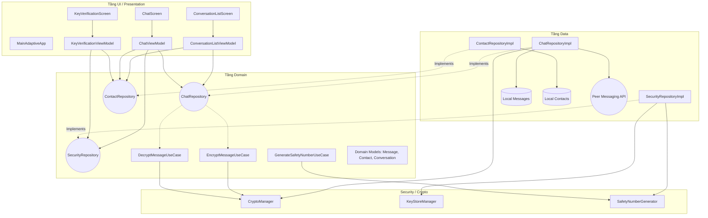
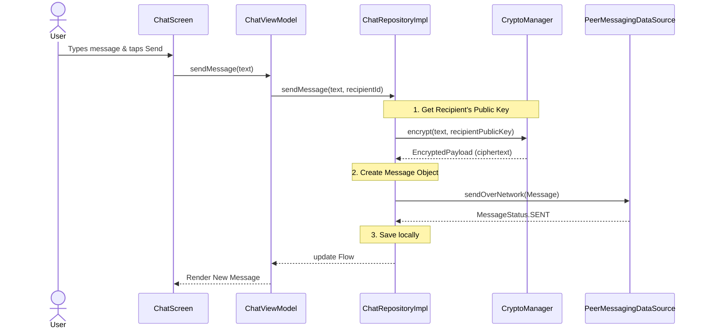

# Tổng quan Kiến trúc GroupChat

Tài liệu này mô tả kiến trúc tổng thể của ứng dụng Android **GroupChat**. Dự án được cấu trúc dựa trên các nguyên tắc của **Clean Architecture** (Kiến trúc Sạch) và tận dụng các công cụ phát triển Android hiện đại bao gồm **Jetpack Compose** (với Adaptive Layouts), **Coroutines/Flows**, và **Manual Dependency Injection** (Tiêm Phụ thuộc Thủ công).

Nó mô phỏng một hệ thống nhắn tin Mã hóa Đầu cuối (E2EE - End-to-End Encrypted).

## Kiến trúc Tổng thể

Ứng dụng được chia thành ba tầng chính để phân tách các mối bận tâm (separation of concerns), cải thiện khả năng kiểm thử và giữ cho giao diện người dùng (UI) độc lập với các nguồn dữ liệu cũng như logic nghiệp vụ:

1.  **Tầng UI / Presentation (Giao diện/Trình bày)**: Xử lý việc kết xuất (render) UI và các tương tác của người dùng.
2.  **Tầng Domain (Nghiệp vụ)**: Chứa logic nghiệp vụ cốt lõi, các use case (trường hợp sử dụng) và các model (mô hình) của doanh nghiệp.
3.  **Tầng Data (Dữ liệu)**: Quản lý việc truy xuất và lưu trữ dữ liệu, triển khai các interface (giao diện) repository được định nghĩa ở tầng Domain.

### Biểu đồ Hệ thống

## Phân tích các Tầng

### 1. Tầng UI / Presentation
-   **Jetpack Compose**: Toàn bộ giao diện người dùng được xây dựng bằng Jetpack Compose.
-   **Adaptive Layouts (Bố cục Thích ứng)**: Sử dụng `androidx.compose.adaptive` (`ListDetailPaneScaffold`) để tự động điều chỉnh bố cục cho các kích thước màn hình khác nhau (ví dụ: hiển thị song song danh sách và chi tiết trên máy tính bảng, hiển thị một màn hình đơn trên điện thoại).
-   **ViewModels**: Mỗi màn hình có một ViewModel tương ứng (ví dụ: `ChatViewModel`) để quản lý trạng thái UI bằng `StateFlow`. ViewModels tương tác trực tiếp với các Repository ở tầng Domain và ánh xạ kết quả thành các trạng thái UI.

### 2. Tầng Domain
-   **Models**: Các data class Kotlin thuần túy đại diện cho các khái niệm cốt lõi (`Message`, `Contact`, `Conversation`, `EncryptedPayload`, `SafetyNumber`).
-   **Interfaces**: Định nghĩa các interface repository (`ChatRepository`, `ContactRepository`, `SecurityRepository`) để áp dụng nguyên lý Đảo ngược Phụ thuộc (Dependency Inversion).
-   **Use Cases / Crypto**: Đóng gói các quy tắc nghiệp vụ cụ thể. `EncryptMessageUseCase` và `DecryptMessageUseCase` quản lý logic E2EE mô phỏng.

### 3. Tầng Data
-   **Repositories**: Các triển khai (implementations) của các interface thuộc tầng Domain (`ChatRepositoryImpl`, v.v.). Chúng điều phối dữ liệu giữa kho lưu trữ cục bộ và mạng.
-   **Data Sources (Nguồn dữ liệu)**:
    -   `LocalMessageDataSource` / `LocalContactDataSource`: Mô phỏng cơ sở dữ liệu lưu trữ cục bộ để cache (lưu đệm) tin nhắn và danh bạ.
    -   `PeerMessagingDataSource`: Mô phỏng tầng mạng thời gian thực (như WebSockets hoặc WebRTC) bằng cách sử dụng `Channel` và `Flow` của Kotlin. Nó xử lý việc "gửi" tin nhắn và giả lập (mock) các phản hồi mã hóa "đến".

### 4. Module Security & Cryptography (Bảo mật & Mật mã)
Xử lý quá trình mô phỏng Mã hóa Đầu cuối:
-   **`KeyStoreManager`**: Quản lý việc tạo, lưu trữ và truy xuất các khóa bất đối xứng (RSA) cho người dùng.
-   **`CryptoManager`**: Xử lý việc mã hóa và giải mã thực tế cho payload (dữ liệu) của tin nhắn.
-   **`SafetyNumberGenerator`**: Tạo ra một dấu vân tay có thể tái tạo (số an toàn - safety number) từ các khóa công khai, cho phép người dùng xác minh danh tính (tương tự như Signal/WhatsApp).

## Ví dụ về Luồng Tin nhắn

Biểu đồ tuần tự dưới đây thể hiện luồng gửi một tin nhắn, từ UI xuống tới tầng mạng mô phỏng, minh họa cho bước mã hóa.

## Dependency Injection (Tiêm Phụ thuộc)
Dự án sử dụng **Tiêm Phụ thuộc Thủ công (Manual Dependency Injection)** thông qua lớp `AppContainer`. Container này tạo và cung cấp các instance duy nhất (singleton) của các repository, data source và manager cho các ViewModels, giữ cho kiến trúc tách biệt (decoupled) mà không gặp phải rào cản quá lớn về chi phí (overhead) của Dagger/Hilt cho phạm vi cụ thể này.
